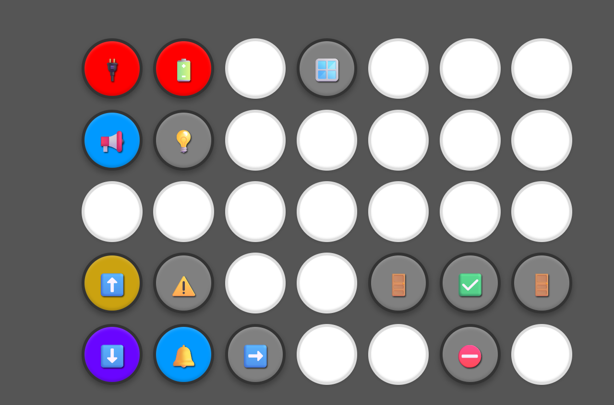
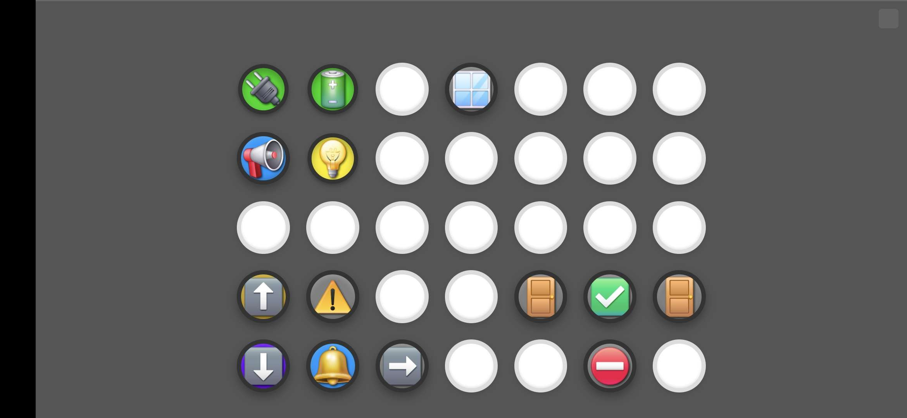
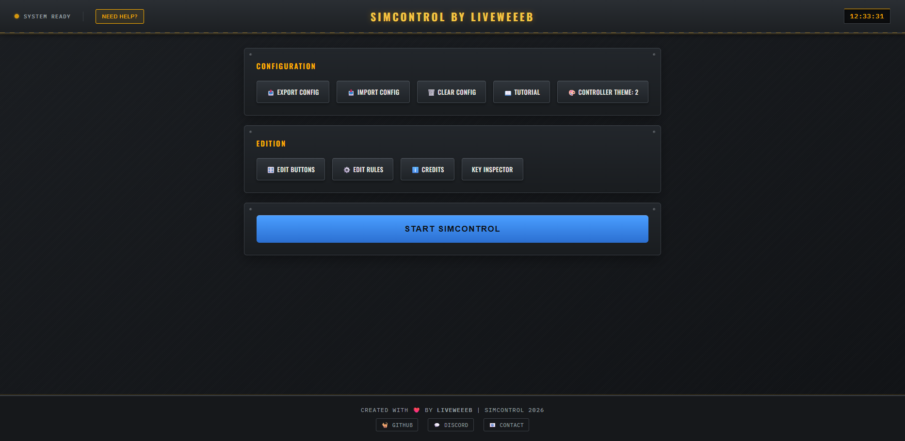
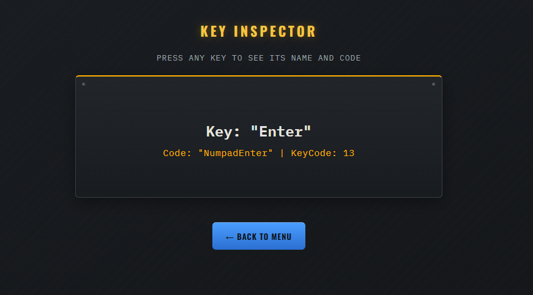

# SimControl 2026

**SimControl** is a custom web Stream Deck turn your phone or tablet into a control panel for simulators. 35 configurable buttons, automatic rules, themes, and full keyboard control.

[](https://github.com/liveweeeb13/SimControl/releases)
[](https://python.org)
[](LICENSE)

---

## Overview

| Controller (PC) | Controller (Mobile) |
|---|---|
|  |  |

| Menu | Key Inspector |
|---|---|
|  |  |

---

## Installation

**Requirements** : Windows 10/11 or Debian 11+, Python 3.8+

```bash
git clone https://github.com/liveweeeb13/SimControl
cd SimControl
pip install -r requirements.txt
python app.py
```

Or download the `.exe` from [Releases](https://github.com/liveweeeb13/SimControl/releases) and run it directly.

The interface is accessible at **http://[IP]:3001** from any device on the same network.

---

## Usage

1. Open **http://[IP]:3001** on PC
2. Click **Edit Buttons** to configure your 35 buttons
3. Click **Start SimControl**
4. Open **http://[IP]:3001/simcontrol** on your phone/tablet (landscape mode recommended)

---

## Configuration

Buttons and rules are stored in `config.js`.

### Button structure

```js
{
    id: 1,              // Position (1–35)
    title: "Battery",   // Name shown in the editor
    label: "BATT",      // Text, emoji or image on the button
    key: "b",           // Keyboard key sent
    toggleable: true,   // true = toggle ON/OFF, false = push
    color1: "#333333",  // Color when OFF
    color2: "#00ff00",  // Color when ON
    holdTime: 0         // Hold duration before trigger (ms)
}
```

### Automatic rules

```js
const rules = {
    // Automatically disables buttons when another changes state
    autodisable: [
        { trigger: 1, targets: [2, 3], condition: "off" }
    ],
    // Blocks buttons based on another button's state
    lock: [
        { trigger: 1, targets: [4, 5], condition: "off" }
    ]
};
```

---

## Compatibility

| OS | Version | Status | Keyboard control |
|---|---|---|---|
| Windows | 10 / 11 | Supported | Full |
| Others | ? | Untested | ? |

---

## Tech stack

- **Backend** : Flask + Flask-SocketIO (Python)
- **Frontend** : HTML / CSS / JS 
- **GUI** : tkinter
- **Keyboard** : pynput 
- **Build** : PyInstaller

---

## Support

- GitHub : [github.com/liveweeeb13](https://github.com/liveweeeb13)
- Discord : [discord.gg/ukJegYrXWR](https://discord.gg/ukJegYrXWR)
- Contact : [discord (liveweeeb)](https://id.rappytv.com/790240841598763018)

---


**Created with ❤️ by liveweeeb | SimControl 2026**

